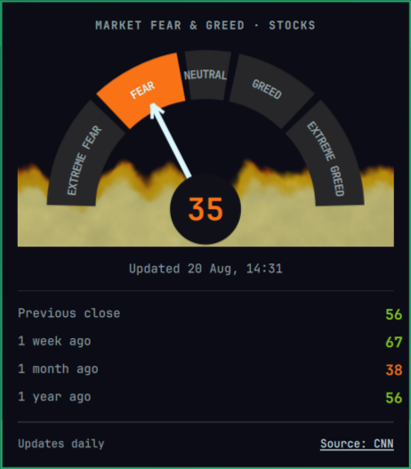

# Market Fear & Greed for Omarchy

An Omarchy bar widget for the US stock-market Fear & Greed Index published by CNN.



## What it shows

- The latest index as a color-coded gauge.
- Previous close, one week ago, one month ago, and one year ago as colored numbers.
- CNN's publication timestamp so weekends and market holidays are clear.
- The last good value when CNN is temporarily unavailable.

Left-click the bar value to open the panel. Right-click the bar value, click
`Source: CNN`, or press Enter/Space while the panel is focused to open CNN's
official index page. Escape closes the panel.

There is deliberately no manual refresh. The plugin makes at most one data
request in any rolling 24-hour period, including across shell and machine
restarts.

## Install

Requires Omarchy 4 (Quattro), `curl`, and `flock` from `util-linux`. These are
part of a standard Omarchy installation.

```bash
omarchy plugin add https://github.com/davidojedalopez/omarchy-fear-greed.git --enable --yes
```

The widget defaults to the center section. Move it with Omarchy's bar settings
if you prefer another position.

## Update

```bash
omarchy plugin update io.github.davidojedalopez.fear-greed
```

## Remove

```bash
omarchy plugin remove io.github.davidojedalopez.fear-greed --yes
```

Cached public index data is stored separately at:

```text
${XDG_CACHE_HOME:-$HOME/.cache}/omarchy/plugins/io.github.davidojedalopez.fear-greed/
```

It may be deleted after removing the plugin.

## Data, privacy, and network behavior

The widget makes one HTTPS request per 24 hours to CNN's first-party data host:

```text
https://production.dataviz.cnn.io/index/fearandgreed/graphdata
```

The endpoint currently rejects ordinary API clients with HTTP 418, so the
request includes a browser-like user agent and CNN's index page as its referrer.
The URL, headers, timeouts, and response-size limit are fixed in the source;
none are user-controlled.

The plugin sends no credentials or local data. It has no telemetry, analytics,
listeners, background services, or privileged operations. It stores only the
normalized public score, comparisons, timestamps, and last-attempt time in the
local cache. The full CNN response and command errors are not persisted.

## Important source limitation

CNN does not publish a supported developer API or redistribution license for
this index. The endpoint above is an internal feed used by CNN's page. It may
change, return HTTP 418, block automated clients, or disappear without notice.
Fetching once daily reduces load but does not make the integration supported by
CNN.

This is an unofficial third-party plugin. It is not affiliated with or endorsed
by CNN, Warner Bros. Discovery, Omarchy, 37signals, or the Omarchy Plugins
community marketplace. CNN owns its names, marks, index, and associated rights.
The MIT license in this repository covers only this plugin's original code.

The index and this plugin are informational only and are not financial or
investment advice.

## Troubleshooting

- `--` means no valid cached reading is available yet.
- `stale` means the panel is showing the last good reading after a failed daily
  request.
- A blocked request is reported as `CNN blocked the data request`; the plugin
  will not attempt another request for 24 hours.
- Validate an installation with:

  ```bash
  omarchy plugin validate "$HOME/.config/omarchy/plugins/io.github.davidojedalopez.fear-greed"
  omarchy-shell shell ping
  ```

Please use the repository's issue templates for reproducible bugs or CNN source
breakage. Security concerns should be reported privately as described in
[SECURITY.md](SECURITY.md).

